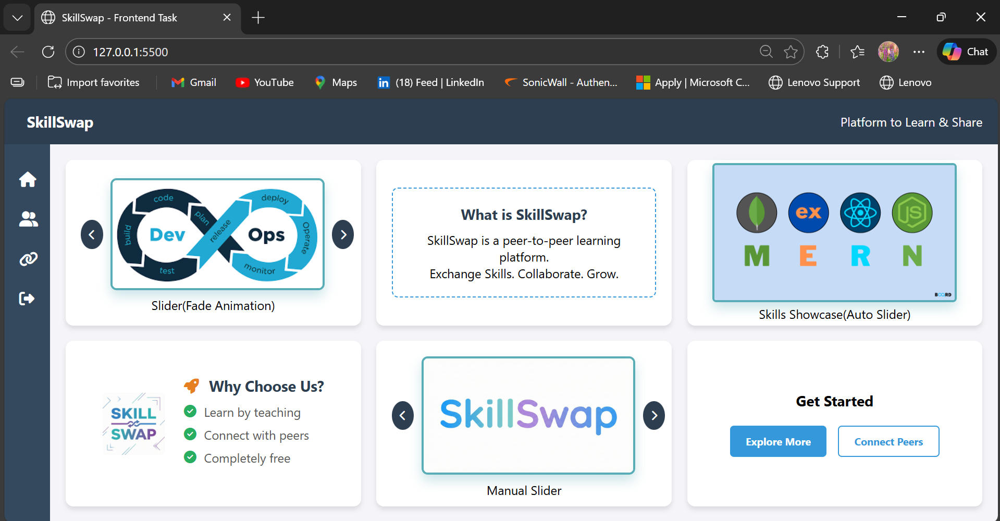
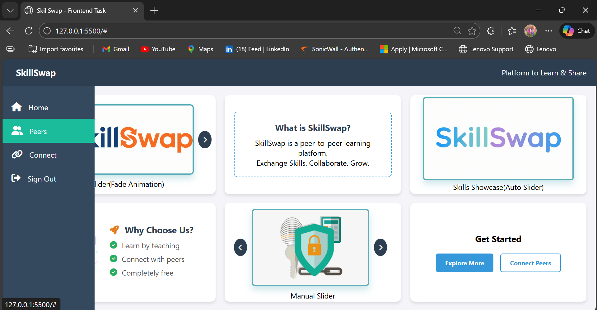
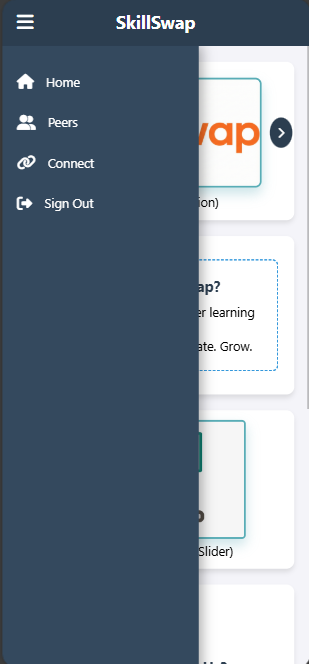
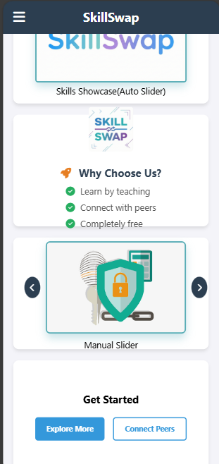

# 🚀 SkillSwap - Peer-to-Peer Learning Platform
This project demonstrates modern frontend development practices using HTML5, CSS3, and JavaScript without external frameworks.

## 🌟 Features

* **Responsive Design:** Fully adaptable layout for Desktop and Mobile devices.
* **Interactive Sidebar:** Collapsible sidebar with hover effects for desktop and hamburger menu for mobile.
* **Image Sliders:**
    * **Auto Slider:** Automatically cycles through images every 2 seconds.
    * **Manual Slider:** User-controlled navigation with previous/next buttons.
    * **Interactive Slider:** Features a "Zoom & Fade" animation effect on image change.
* **Modern UI Components:** Gradient buttons, card hover effects, and a clean grid layout.
* **Font Awesome Integration:** High-quality icons for visual enhancement.

## 🛠️ Tech Stack

* **Frontend:** HTML5, CSS3, JavaScript (ES6)
* **Icons:** Font Awesome CDN
* **Design:** CSS Grid & Flexbox

## 📸 Screenshots

### Desktop View



### Mobile View



## 📂 Project Structure

```bash
SkillSwap/
├── index.html        # Main HTML structure
├── style.css         # Styling and responsive media queries
├── script.js         # Slider logic and sidebar toggles
├── README.md         # Project documentation
└── images/           # Asset folder for slider images and logo
